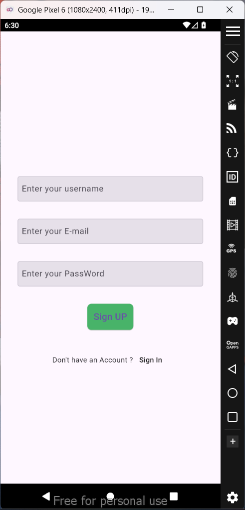
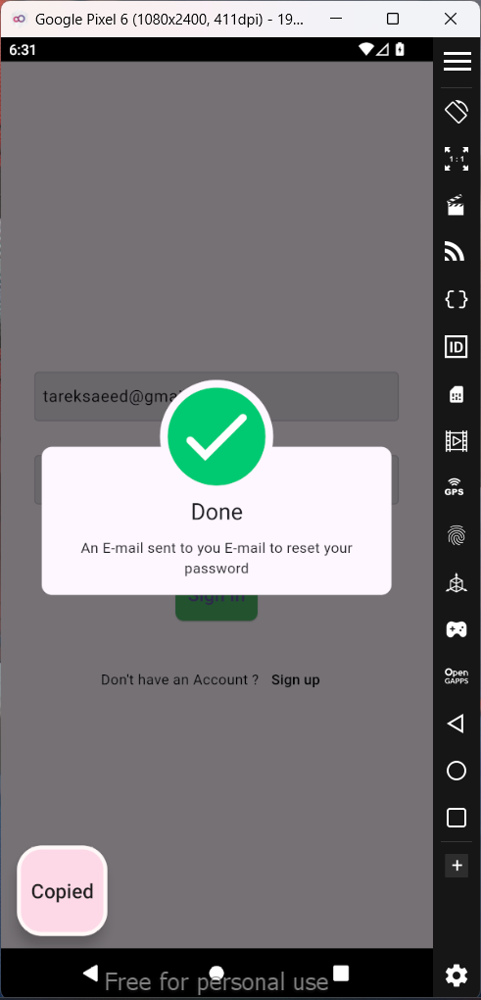
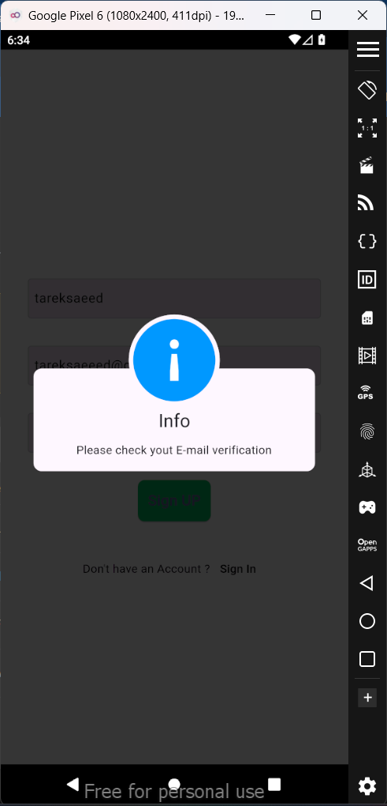
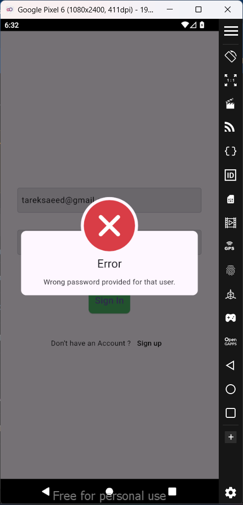
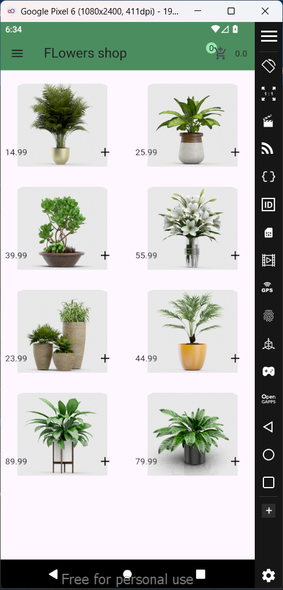
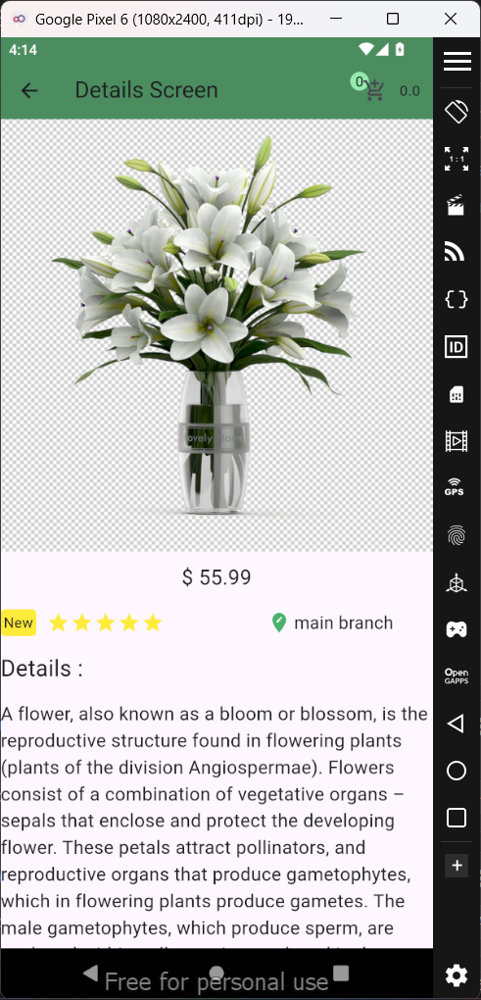
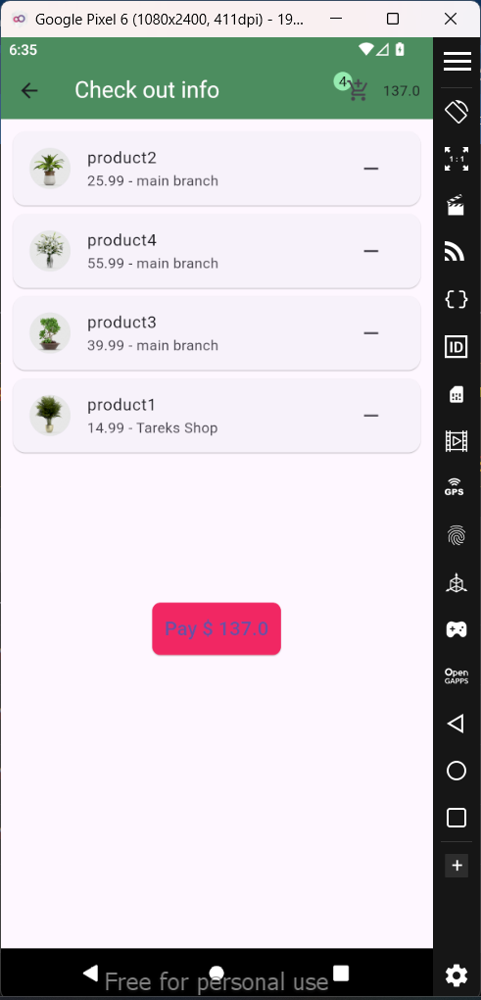

# flowers_app

A beautiful and user-friendly Flutter application for a flowers shop. This app provides customers with a seamless experience to browse, select, and purchase flowers conveniently.

## Features

- **Register and Login Features:**  
  Secure authentication using Firebase for user registration and login.

- **Shopping Cart:**  
  Add your favorite flowers to the cart and manage your orders efficiently.

- **Explore Flowers:**  
  Browse a wide range of flowers with detailed descriptions and images.


### Screenshot 1: Register Screen


This is the register screen where users can create a new account by entering their details.

### Screenshot 2: Login Screen


This is the login screen where users can enter their credentials to access the app.

### Screenshot 3: Login Success


This screenshot shows the screen users see after successfully logging in.

### Screenshot 4: Login Verification


This is the screen where the app is verifying the user's login credentials.

### Screenshot 5: Login Wrong Password


This screen appears when the user enters the wrong password during login.

### Screenshot 6: Home Screen


This is the home screen where users can view featured products and navigate through the app.

### Screenshot 7: Home Screen Drawer


This is the side drawer menu on the home screen where users can access additional options.

### Screenshot 8: Details Screen


This is the details screen where users can view more information about a selected product.

### Screenshot 9: Products Added Screen


This screenshot shows the screen confirming the products have been added to the cart.


## Technologies Used

- **Flutter**: For the frontend and app functionality.  
- **Dart**: Programming language.  
- **Firebase**: For authentication.  
- **Provider**: For state management.


## Installation 

1. Clone the repository:
   ```bash
   git clone https://github.com/TareKSaeedd/flowers-shop.git
